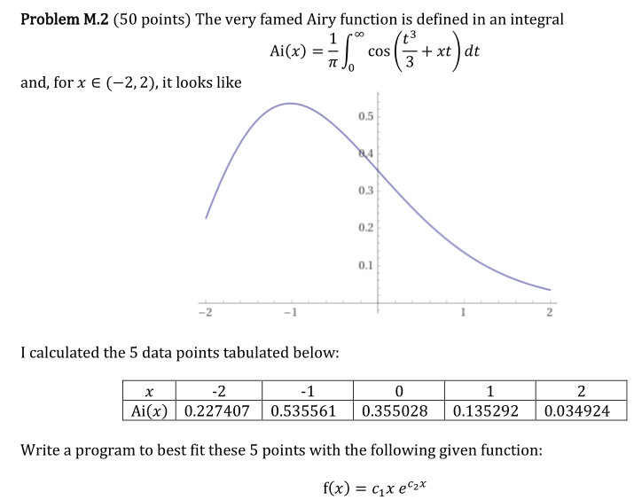
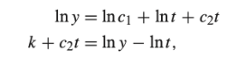
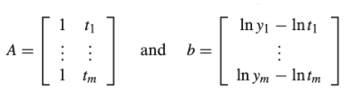
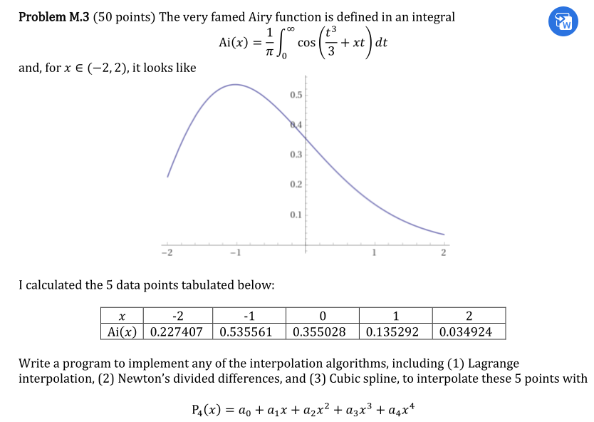
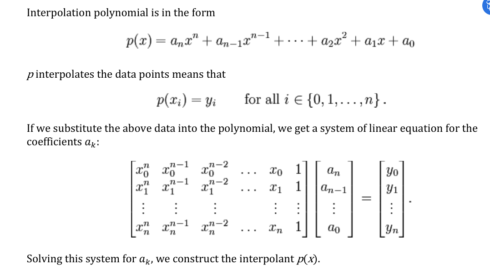
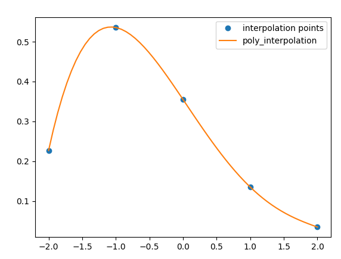

# Basic Info

**Name**: Ni Jiasheng

**Environment**: python3.8.5 with pycharm

**Problems to do**: Problem2 and Problem3


# Problem 2

## Problem Description




## Program

```python
    def problem2(self,datapoints,f=None,option="normal"):
        assert datapoints is not None

        if option == "normal":

            # Adjust the x axis to lie in domain

            x_data = np.array(list(map(lambda x:x[0],datapoints)))
            y_data = np.array(list(map(lambda x:x[1],datapoints)))


            # 1. Construct AX=b with order = 1
            A = self.construct_A(datapoints,1)
            b = self.construct_b(datapoints,"polynomial")

            # 2 and 3 Use Normal Equation to solve the linear system
            x,rsme = self.normalEquation(A,b)

            k, c2 = x
            c1 = np.exp(k)

            f = lambda t, a, b: a * t * np.exp(b * t)

            # Draw original points
            plt.plot(x_data,y_data , "o", label="datapoints")


            # 
            x_points = np.linspace(x_data[0], y_data[-1], 100)
            y_hat = f(x_points, c1, c2)
            plt.plot(x_points, y_hat, "g", label="fitted")

            plt.legend()
            plt.show()

        else:
            assert f is not None
            self.polynomialFittingPackage(f,datapoints)

```


## Algorithm






## Results

### Obtain AX=b

```python
    def construct_A(self,datapoints,order):
        # k + c2x = lny-lnx

        res_list = []
        for pair in datapoints:
            x = pair[0]
            tmp_list = []
            for t in range(order, -1, -1):
                tmp_list.append(x ** t)
            res_list.append(tmp_list)

        return np.array(res_list)


    def construct_b(self,datapoints,option="polynomial"):
        b_res = []
        for pair in datapoints:
            y = pair[1]
            x = pair[0]
            if option == "exponential":
                b_res.append(math.log(y) - math.log(x))
            elif option == "polynomial":
                b_res.append(y)

        return np.array(b_res)
```


### Obtain Normal Equation

```python
 def normalEquation(self, A, b):
        # x = (A^T*A)^(-1)*(A^T*y)

        # 1. Obtain Normal Equation Solution
        x = np.dot(np.linalg.inv(np.dot(A.T, A)), np.dot(A.T, b))

        # 2. Compute RMSE
        # 2.1 b is the true value, Ax = b_hat is the LS estimation
        rsme = np.sqrt(np.mean(np.square(np.dot(A, x) - b)))
        print("Solution: {}".format(x))
        print("RMSE: {}".format(rsme))
        return x, rsme
```


### Solve Coefficient

|  c1  | -0.06861319 |
| :--: | :---------: |
|  c2  | -0.43241871 |


### RSME

RMSE: 0.13457383719185537


# Problem 3

## Problem Description




## Program

The following is the main function 

```python
    def problem3(self,datapoints):
        A = self.construct_A(datapoints,4)
        b = self.construct_b(datapoints,"polynomial")

        # Coefficient
        coeff = np.linalg.solve(A, b)

        # Plot the graph
        # x0 is the independent variables, func is the interpolation function
        x0, func = self.formatPoly(4,coeff)
        self.plotInterpolation(datapoints, func, x0)
```


## Algorithm




## Results&Performance

### Coefficient

|  a0  |       0.355028       |
| :--: | :------------------: |
|  a1  |     -0.25080575      |
|  a2  | -0.00748012500000006 |
|  a3  |      0.05067125      |
|  a4  |     -0.012121375     |


### Equation

The obtained equation is `-0.012121375*x**4 + 0.05067125*x**3 - 0.00748012500000006*x**2 - 0.25080575*x + 0.355028`


### Plot




